# Examples

This file contains different example queries and their outputs.

## Policy-Related Questions

> 1. How many policies are present? If they are present, provide their names and IDs.

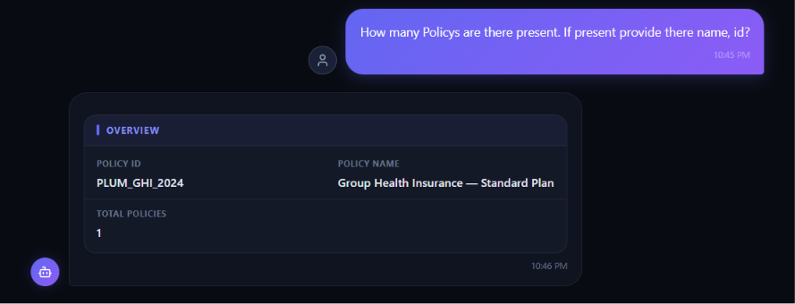

> Provide the details of the members associated with the policy `Group Health Insurance - Standard Plan`.


> Which hospitals are networked under policy ID `PLUM_GHI_2024`?

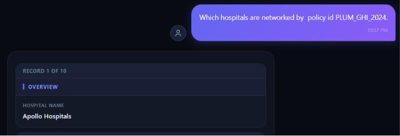

> Which family relations are covered in the policy `Group Health Insurance - Standard Plan`?

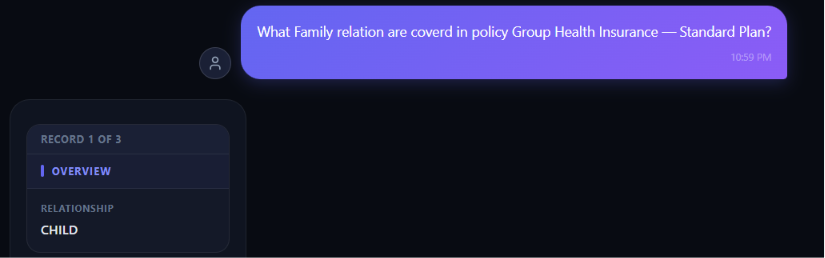

> What would be the network discount if I made my policy claim at Apollo Hospitals?

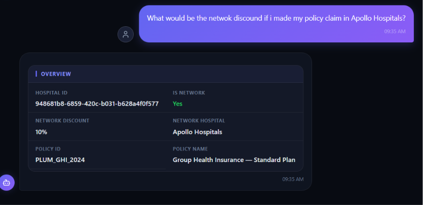

### Issue
```sql
SELECT 
    CASE 
        WHEN h.hospital_name = 'Apollo Hospitals' THEN p.policy_name 
        ELSE NULL 
    END AS policy_name,
    p.policy_id,
    h.hospital_id,
    nh.hospital_name AS network_hospital,
    h.is_network_hospital AS is_network,
    CASE 
        WHEN h.is_network_hospital = TRUE THEN '10%' 
        ELSE '0%' 
    END AS network_discount
FROM 
    policies p
JOIN 
    network_hospitals nh ON p.policy_id = nh.policy_id
JOIN 
    hospitals h ON nh.hospital_name = h.hospital_name
WHERE 
    h.hospital_name = 'Apollo Hospitals'
```

The discount was hardcoded to `10%`.

## Member-Related Questions

> Is there any member named Rajesh Kumar related to the policy `PLUM_GHI_2024`? If yes, provide their details.
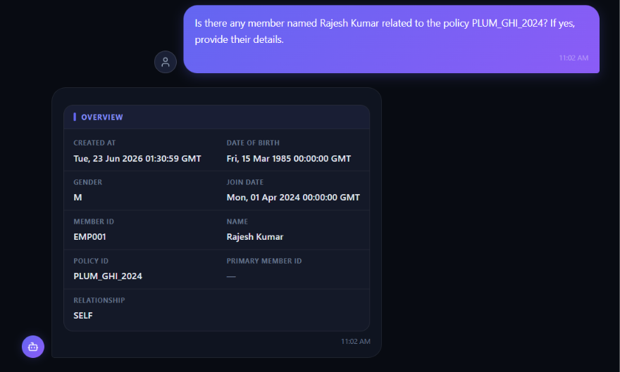


> How many members do not have the `SELF` relation under policy `PLUM_GHI_2024`?

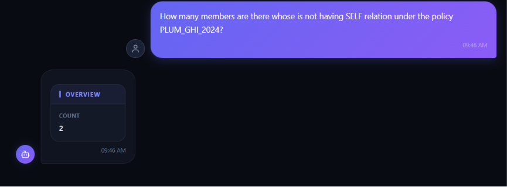

> Are there any members related to employee ID `EMP001`? If yes, provide their details.


### Issue
If no values are present, it returns an empty dataframe directly.
An overview message can be added before the response.

## Claim-Related Questions

> What are my recent claims?

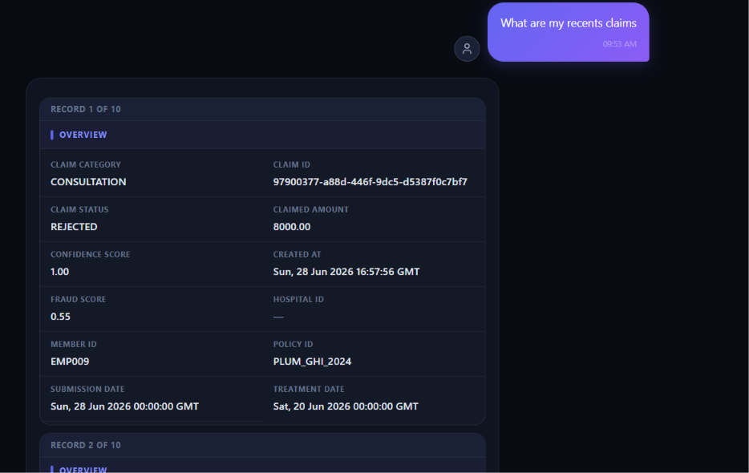

### Issue
```sql
SELECT * FROM claims ORDER BY created_at DESC LIMIT 10;
```

This shows data from all available claims. The query should fail or respond more clearly when there is not enough scoped data.

> What is the status of my recent claim for employee ID `EMP001`?

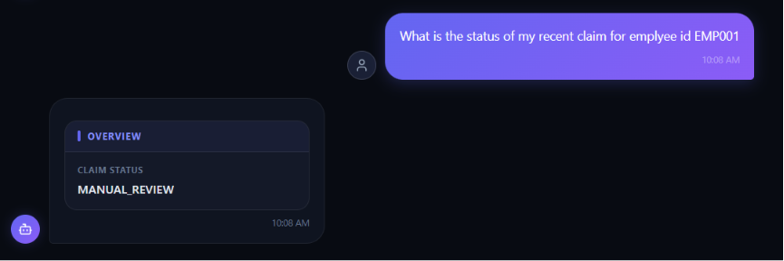

> Why was my last claim rejected? What is the reason behind that decision for claim ID `97900377-a88d-446f-9dc5-d5387f0c7bf7`?

### Empty response must be handled

> Tell me about the decision explanation for my claim `75234087-d395-46c1-9ef3-0f2f9359c00b`.

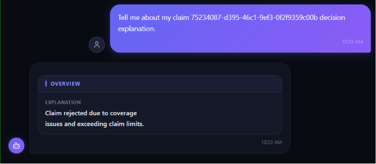

> Provide the list of all statuses and explanations for all claims made by member ID `EMP001`.

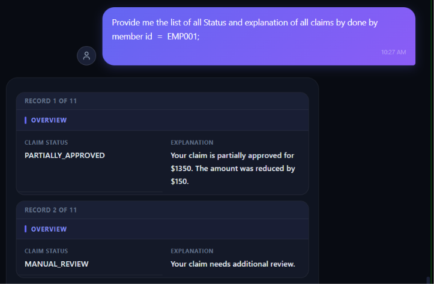

> Provide the list of claims with `MANUAL_REVIEW` status for Rajesh Kumar.

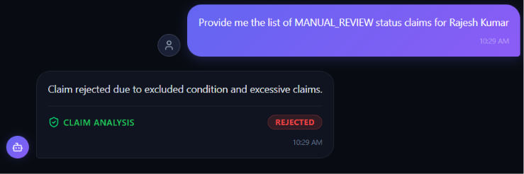

### Issue
```text
The request was made to fetch data, but it triggered a claim approval request instead.
```

> Provide all claim details for the member Rajesh Kumar where the claim decision was `MANUAL_REVIEW`.

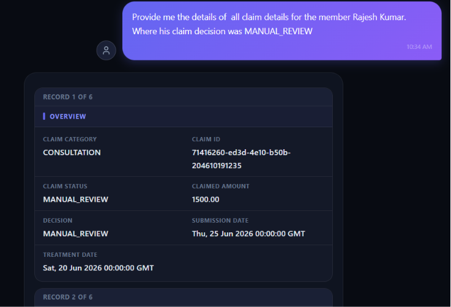

## Making Claims

The following checks should be done before making any claim.

> Employee ID and claim category

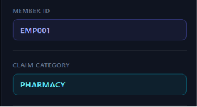

> For document upload, use:


> Status check for uploaded documents

1. Upload document:

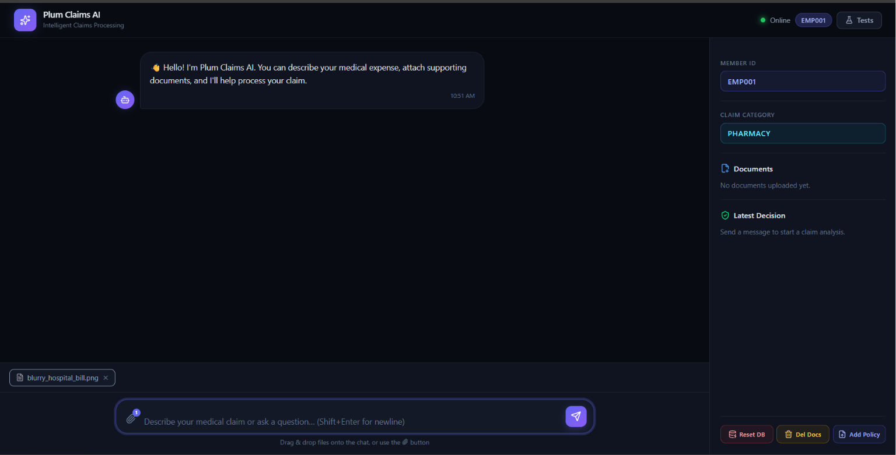

2. Check status:

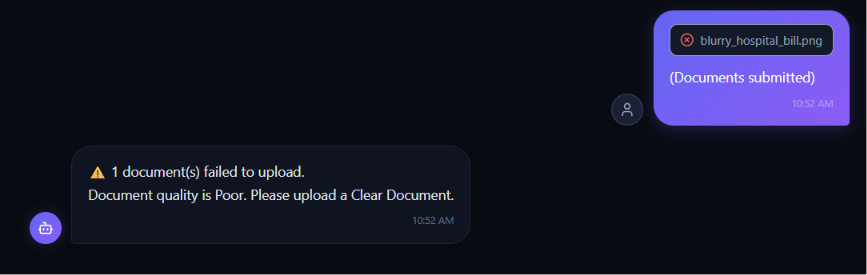

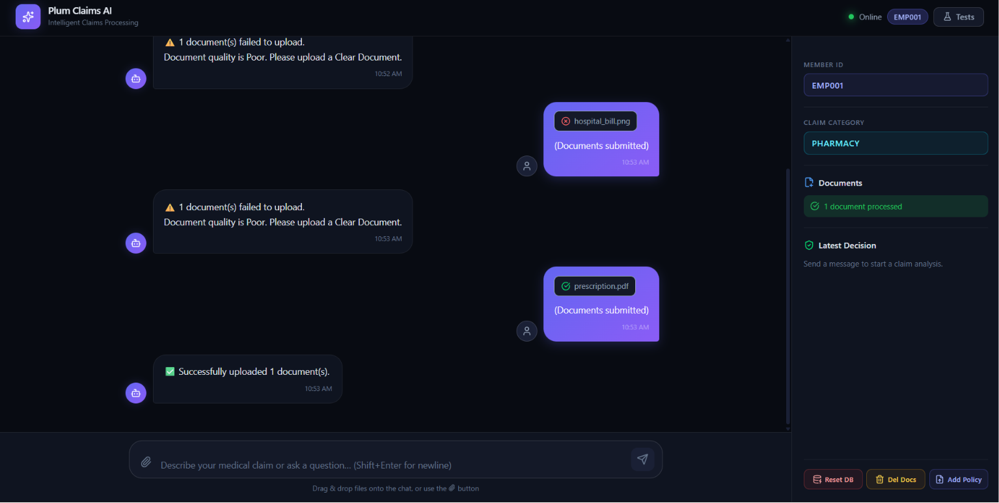

## Admin Requests

### Update claim status

1. User: I want to update a claim.

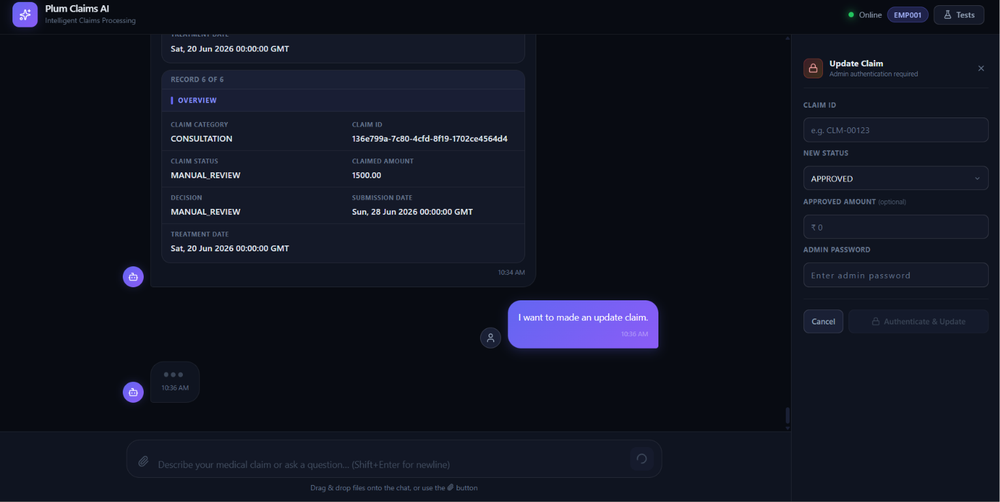

2. Add details.

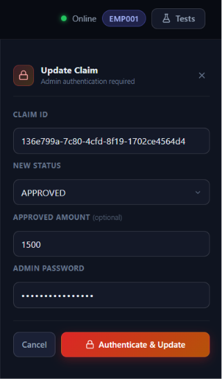

3. Successful query.

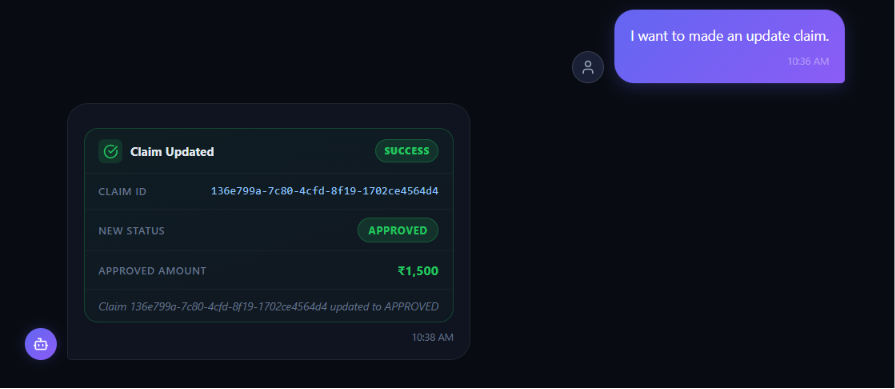

### Case 2

> Wrong authentication

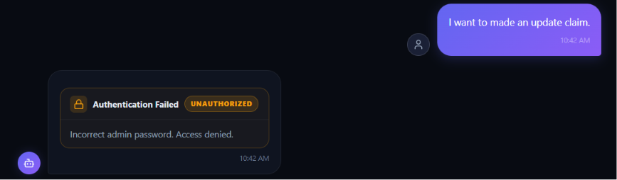

### Case 3

> Wrong & Invalid claim id


## Other Operations

1. Reset DB (requires password)
2. Delete document for a particular employee ID
3. Add a policy to the DB (requires a structured JSON file)

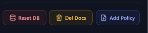

## Test


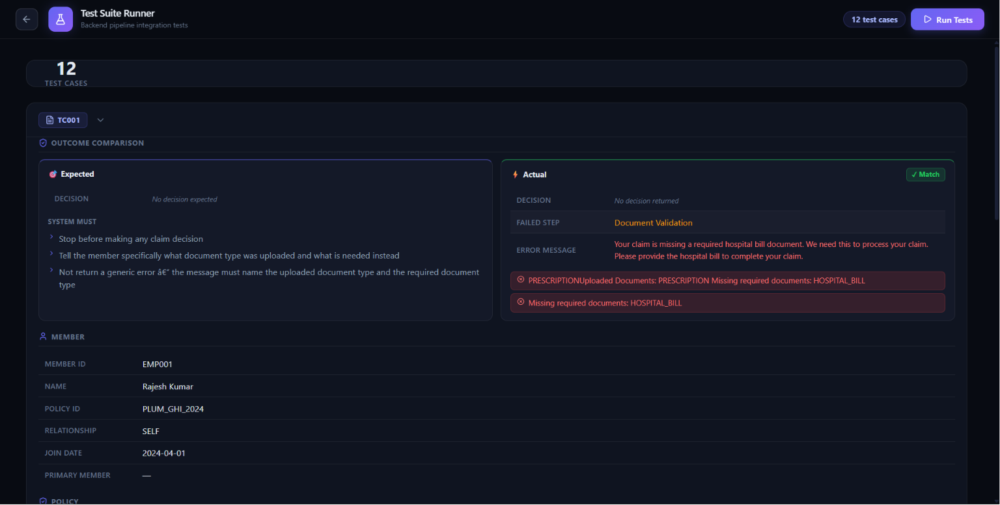

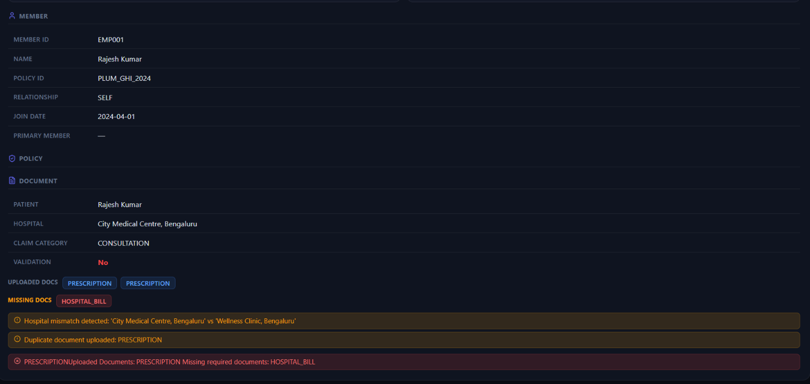
