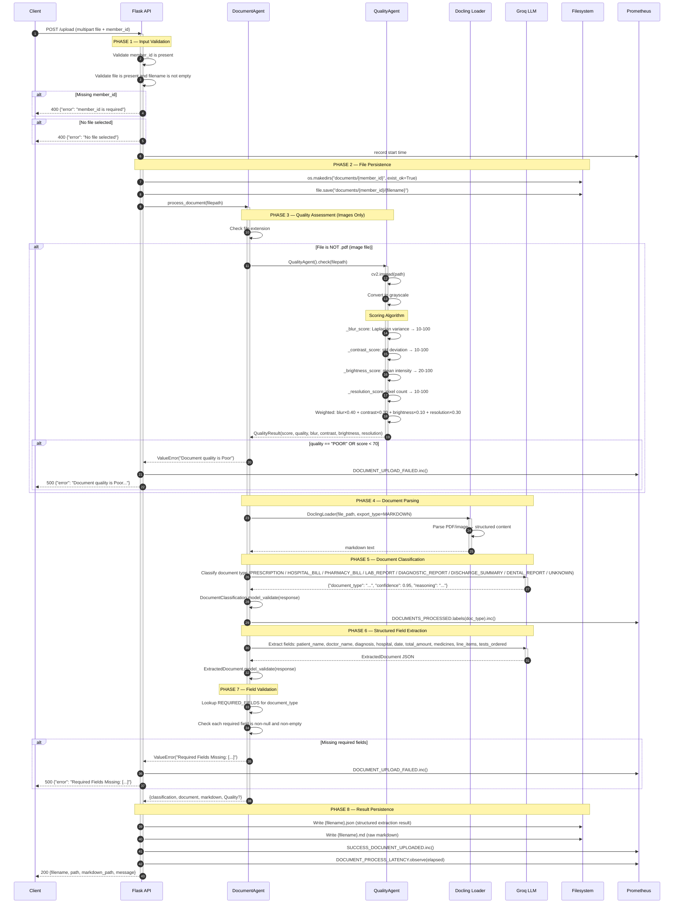
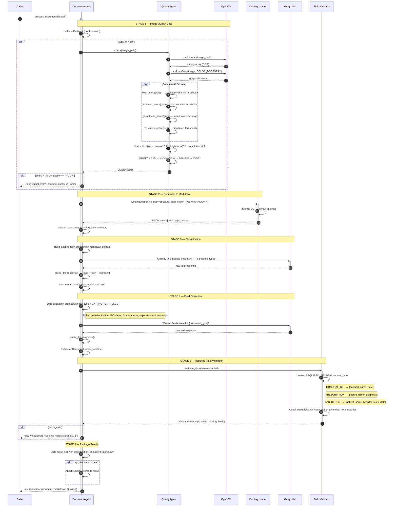
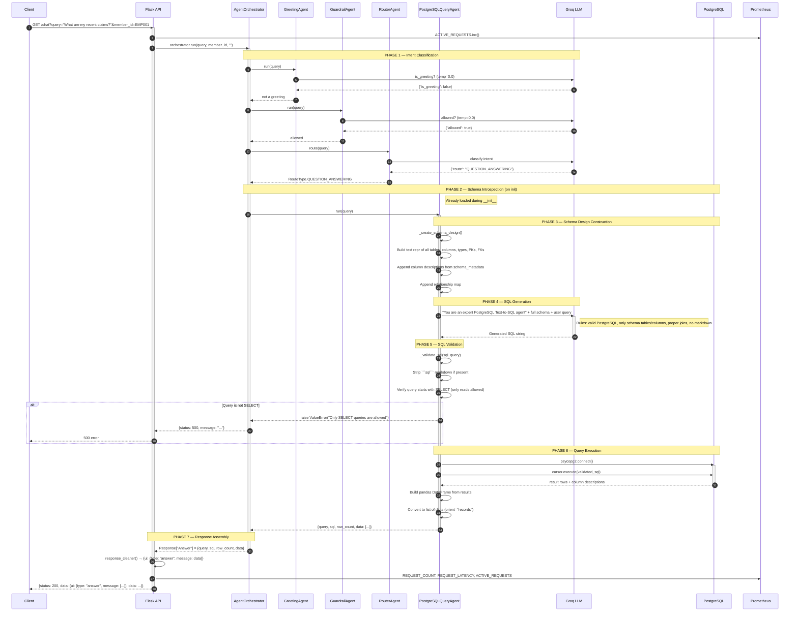
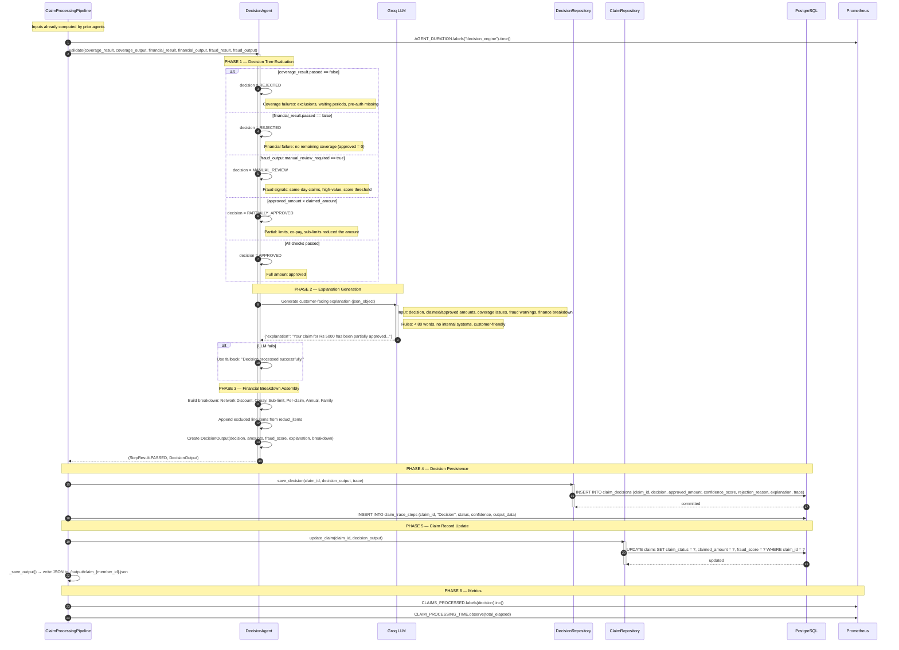
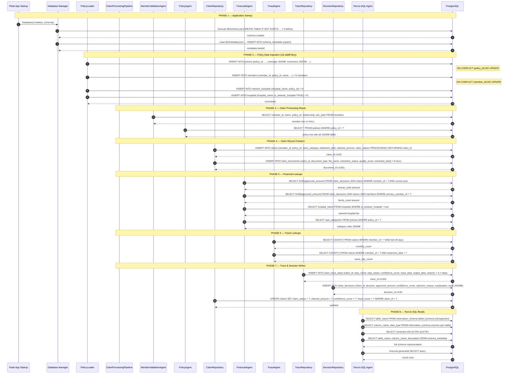
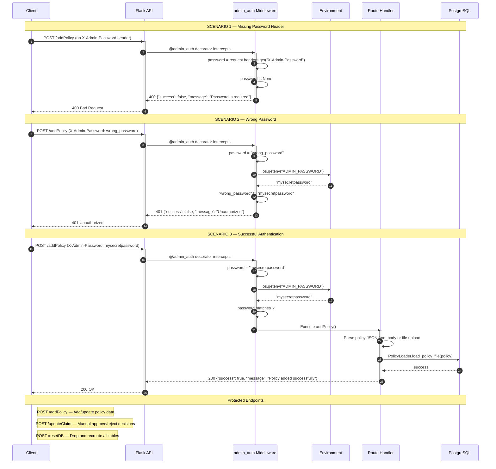
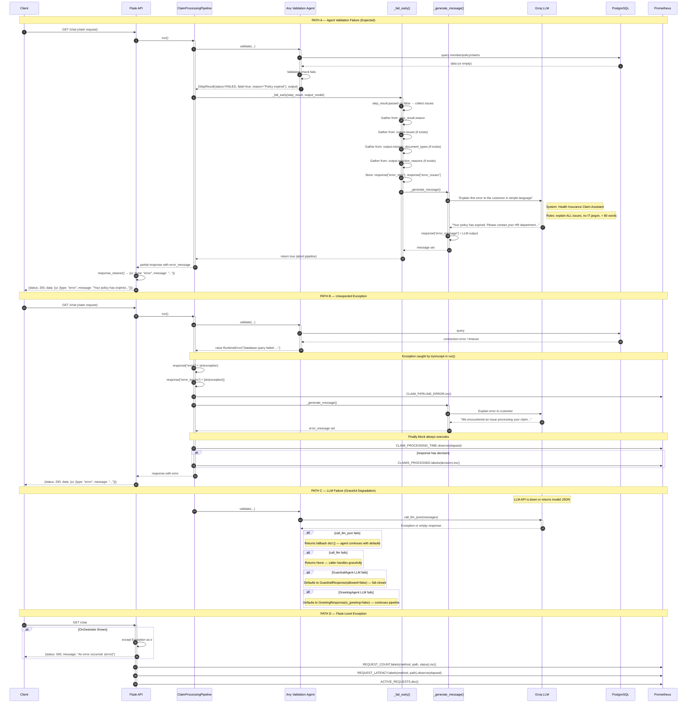

# Insurance Claims Backend — Architecture Documentation

> System Design Diagrams for the OPD Claims Adjudication Platform

---

## 1. Claim Processing Pipeline

The end-to-end claim processing flow from user chat request through the agent orchestrator, the seven-step adjudication pipeline, database persistence, and response delivery.

```mermaid
sequenceDiagram
    autonumber
    participant Client
    participant Flask as Flask API
    participant Orch as AgentOrchestrator
    participant Greet as GreetingAgent
    participant Guard as GuardrailAgent
    participant Router as RouterAgent
    participant Pipeline as ClaimProcessingPipeline
    participant MemberV as MemberValidationAgent
    participant PolicyV as PolicyAgent
    participant DocV as DocumentValidationAgent
    participant CovV as CoverageAgent
    participant FinV as FinancialAgent
    participant FraudV as FraudAgent
    participant DecV as DecisionAgent
    participant LLM as Groq LLM
    participant DB as PostgreSQL
    participant Prom as Prometheus

    Client->>Flask: GET /chat?query=...&member_id=...&claim_category=...
    activate Flask
    Note over Flask,Prom: PHASE 1 — Request Instrumentation
    Flask->>Prom: ACTIVE_REQUESTS.inc()
    Flask->>Flask: record request.start_time

    Flask->>Orch: orchestrator.run(query, member_id, category)
    activate Orch

    Note over Orch,LLM: PHASE 2 — Pre-routing Classification
    Orch->>Greet: greeting_agent.run(query)
    activate Greet
    Greet->>LLM: Classify: is_greeting? (temp=0.0, json_object)
    LLM-->>Greet: {"is_greeting": false}
    Greet-->>Orch: GreetingResponse(is_greeting=false)
    deactivate Greet

    Orch->>Guard: guardrail_agent.run(query)
    activate Guard
    Guard->>LLM: Security check: allowed? (temp=0.0, json_object)
    LLM-->>Guard: {"allowed": true}
    Guard-->>Orch: GuardrailResponse(allowed=true)
    deactivate Guard

    Orch->>Router: router_agent.route(query)
    activate Router
    Router->>LLM: Classify intent (json_object)
    LLM-->>Router: {"route": "CLAIM_PROCESSING"}
    Router-->>Orch: RouterResponse(route=CLAIM_PROCESSING)
    deactivate Router

    Note over Orch,DB: PHASE 3 — Pipeline Initialization
    Orch->>Pipeline: ClaimProcessingPipeline(member_id, category, output_dir)
    activate Pipeline
    Pipeline->>Pipeline: Initialize state, TraceRepository, DecisionRepository

    Note over Pipeline,DB: PHASE 4 — Member Validation
    Pipeline->>Prom: AGENT_DURATION.labels("member_validation").time()
    Pipeline->>MemberV: validate(member_id)
    activate MemberV
    MemberV->>DB: SELECT member_id, name, policy_id FROM members WHERE member_id = ?
    DB-->>MemberV: member row
    MemberV->>MemberV: Check: member exists, has policy, has name
    MemberV-->>Pipeline: (StepResult.PASSED, MemberData)
    deactivate MemberV
    Pipeline->>Pipeline: _fail_early(member_result) → false, continue

    Note over Pipeline,DB: PHASE 5 — Policy Validation
    Pipeline->>Prom: AGENT_DURATION.labels("policy_validation").time()
    Pipeline->>PolicyV: validate(policy_id)
    activate PolicyV
    PolicyV->>DB: SELECT * FROM policies WHERE policy_id = ?
    DB-->>PolicyV: policy row (JSONB coverage, exclusions, thresholds...)
    PolicyV->>PolicyV: Check: exists, start/end dates, renewal_status
    PolicyV-->>Pipeline: (StepResult.PASSED, PolicyData)
    deactivate PolicyV
    Pipeline->>Pipeline: _fail_early(policy_result) → false, continue

    Note over Pipeline,DB: PHASE 6 — Document Load & Validation
    Pipeline->>Prom: AGENT_DURATION.labels("document_validation").time()
    Pipeline->>Pipeline: _load_documents() — glob ./documents/{member_id}/*.json
    Pipeline->>DocV: validate(documents, member_name, policy, category)
    activate DocV
    DocV->>DocV: Check required docs from policy.document_requirements
    DocV->>DocV: Check confidence thresholds (< 0.40 = unreadable)
    DocV->>DocV: SequenceMatcher: patient name cross-check (>= 0.80)
    DocV->>DocV: Check patient vs member name match
    DocV->>DocV: Detect duplicate doc types
    DocV-->>Pipeline: (StepResult.PASSED, DocumentValidationOutput)
    deactivate DocV
    Pipeline->>Pipeline: _fail_early(document_result, document_output) → false

    Note over Pipeline,DB: PHASE 7 — Claim Record Creation
    Pipeline->>Prom: AGENT_DURATION.labels("claim_creation").time()
    Pipeline->>DB: INSERT INTO claims (...) VALUES (...) RETURNING claim_id
    DB-->>Pipeline: claim_id (UUID)
    Pipeline->>DB: INSERT INTO claim_trace_steps (claim_id, step_name, ...)
    Pipeline->>DB: INSERT INTO claim_documents (claim_id, doc_type, extracted_data, ...)

    Note over Pipeline,DB: PHASE 8 — Coverage Validation
    Pipeline->>Prom: AGENT_DURATION.labels("coverage_validation").time()
    Pipeline->>CovV: validate(member, policy, documents, doc_data, category)
    activate CovV
    CovV->>CovV: Extract treatment_date, diagnosis, claimed_amount from docs
    CovV->>CovV: Check relationship coverage
    CovV->>CovV: Check initial waiting period
    CovV->>CovV: Check treatment_date >= join_date
    CovV->>DB: SELECT opd_categories FROM policies (for DIAGNOSTIC pre-auth)
    CovV->>CovV: Check pre-authorization (high-value tests > threshold)
    CovV->>CovV: Check specific condition waiting periods
    CovV->>CovV: Check exclusions (keyword match on diagnosis/tests)
    CovV->>CovV: Check minimum claim amount
    CovV->>CovV: Check submission window deadline
    CovV-->>Pipeline: (StepResult, CoverageValidationOutput)
    deactivate CovV
    Pipeline->>DB: INSERT INTO claim_trace_steps

    Note over Pipeline,DB: PHASE 9 — Financial Validation
    Pipeline->>Prom: AGENT_DURATION.labels("financial_validation").time()
    Pipeline->>FinV: validate(member, policy, documents, doc_data, category)
    activate FinV
    FinV->>FinV: Extract claimed_amount from docs (max of total_amount or sum line_items)
    FinV->>DB: SELECT hospital_name FROM hospitals WHERE is_network_hospital = true
    FinV->>FinV: Apply network discount if hospital matches
    FinV->>DB: SELECT opd_categories FROM policies (category rules)
    FinV->>FinV: Apply co-pay deduction
    FinV->>FinV: Subtract excluded line items (excluded_procedures match)
    FinV->>FinV: Cap at per_claim_limit
    FinV->>FinV: Cap at category sub_limit
    FinV->>DB: SELECT SUM(approved_amount) FROM claim_decisions (annual usage)
    FinV->>FinV: Cap at remaining annual OPD limit
    FinV->>DB: SELECT SUM(approved_amount) for all family members (floater usage)
    FinV->>FinV: Cap at remaining family floater limit
    FinV-->>Pipeline: (StepResult, FinancialValidationOutput)
    deactivate FinV
    Pipeline->>DB: INSERT INTO claim_trace_steps

    Note over Pipeline,DB: PHASE 10 — Fraud Detection
    Pipeline->>Prom: AGENT_DURATION.labels("fraud_validation").time()
    Pipeline->>FraudV: validate(member, policy, documents, financial_output)
    activate FraudV
    FraudV->>DB: SELECT COUNT(*) FROM claims WHERE member_id = ? AND last 30 days
    FraudV->>FraudV: monthly_claims >= limit? → fraud_score += 0.30
    FraudV->>DB: SELECT COUNT(*) FROM claims WHERE treatment_date = ?
    FraudV->>FraudV: same_day_claims >= limit? → fraud_score += 0.25, manual_review
    FraudV->>FraudV: claimed_amount > high_value_threshold? → fraud_score += 0.20
    FraudV->>FraudV: amount > auto_manual_review_above? → manual_review
    FraudV->>FraudV: fraud_score >= threshold? → manual_review
    FraudV-->>Pipeline: (StepResult.PASSED, FraudValidationOutput)
    deactivate FraudV
    Pipeline->>DB: INSERT INTO claim_trace_steps

    Note over Pipeline,LLM: PHASE 11 — Decision Engine
    Pipeline->>Prom: AGENT_DURATION.labels("decision_engine").time()
    Pipeline->>DecV: validate(coverage, financial, fraud results + outputs)
    activate DecV
    DecV->>DecV: Determine: REJECTED / MANUAL_REVIEW / PARTIAL / APPROVED
    DecV->>LLM: Generate customer explanation (< 80 words, json_object)
    LLM-->>DecV: {"explanation": "..."}
    DecV->>DecV: Build financial_breakdown table
    DecV-->>Pipeline: (StepResult, DecisionOutput)
    deactivate DecV
    Pipeline->>DB: INSERT INTO claim_decisions (decision, amount, explanation, trace)
    Pipeline->>DB: INSERT INTO claim_trace_steps

    Note over Pipeline,Prom: PHASE 12 — Persistence & Metrics
    Pipeline->>DB: UPDATE claims SET claim_status = ?, fraud_score = ?
    Pipeline->>Pipeline: Save JSON to ./output/claim_{member_id}.json
    Pipeline->>Prom: CLAIM_PROCESSING_TIME.observe(elapsed)
    Pipeline->>Prom: CLAIMS_PROCESSED.labels(decision).inc()

    Pipeline-->>Orch: response dict
    deactivate Pipeline

    Orch-->>Flask: response
    deactivate Orch

    Note over Flask: PHASE 13 — Response Formatting
    Flask->>Flask: response_cleaner() → {ui: {type: "decision", message: ...}}
    Flask->>Prom: REQUEST_COUNT.labels().inc()
    Flask->>Prom: REQUEST_LATENCY.labels().observe()
    Flask->>Prom: ACTIVE_REQUESTS.dec()
    Flask-->>Client: {status: 200, data: {ui: {...}, data: {...}}}
    deactivate Flask
```

---

## 2. Document Upload Pipeline

The complete flow when a user uploads a medical document (PDF, image) through the `/upload` endpoint — parsing, classification, extraction, quality check, and storage.

---

## 3. Document Extraction Pipeline

Detailed internal flow of the `DocumentAgent.process_document()` method — from raw file to structured, validated medical document data.

---

## 4. Question Answering Pipeline

The text-to-SQL flow for natural-language questions about policies, claims, and members — from user query through schema awareness, SQL generation, validation, execution, and result formatting.

---

## 5. Decision Making Pipeline

The internal decision engine that aggregates coverage, financial, and fraud validation results into a final claim adjudication decision with an LLM-generated explanation.

---

## 6. Database Interaction Flow

Complete view of all database operations across the system — schema initialization, policy ingestion, claim lifecycle, and query support.

---

## 7. Authentication Flow

The admin authentication middleware protecting sensitive endpoints — policy management, claim updates, and database resets.

---

## 8. Error Handling Flow

How errors propagate through the system — from individual agent failures to pipeline-level exceptions, LLM-generated user messages, metric recording, and graceful degradation.

---

## Index of Database Tables Referenced

| Table | Primary Operations | Referenced By |
|---|---|---|
| `policies` | SELECT, INSERT/UPSERT | PolicyAgent, CoverageAgent, FinancialAgent, PolicyLoader |
| `members` | SELECT, INSERT/UPSERT | MemberValidationAgent, FinancialAgent, PolicyLoader |
| `hospitals` | SELECT, INSERT/UPSERT | FinancialAgent, PolicyLoader |
| `network_hospitals` | SELECT, INSERT | FinancialAgent, PolicyLoader |
| `claims` | INSERT, UPDATE, SELECT | ClaimRepository, FraudAgent, FinancialAgent |
| `claim_documents` | INSERT | ClaimRepository |
| `claim_decisions` | INSERT, UPDATE, SELECT | DecisionRepository, FinancialAgent, DataIngestion |
| `claim_trace_steps` | INSERT | TraceRepository |
| `schema_metadata` | SELECT, INSERT | DatabaseManager, Text-to-SQL Agent |

---

## Prometheus Metrics Map

| Metric | Type | Emitted By | Labels |
|---|---|---|---|
| `http_requests_total` | Counter | Flask after_request | method, endpoint, status |
| `http_request_duration_seconds` | Histogram | Flask after_request | method, endpoint |
| `active_requests` | Gauge | Flask before/after_request | — |
| `claims_processed_total` | Counter | Pipeline finally block | decision |
| `claim_processing_seconds` | Histogram | Pipeline finally block | — |
| `claim_pipeline_error_total` | Counter | Pipeline except block | — |
| `agent_duration_seconds` | Histogram | Pipeline per-agent wrapper | agent |
| `documents_processed_total` | Counter | DocumentAgent._classify | type |
| `document_process_duration_seconds` | Histogram | Flask /upload | — |
| `document_uploaded_total` | Counter | Flask /upload success | — |
| `document_upload_failed_total` | Counter | Flask /upload error | — |
| `llm_calls_total` | Counter | LLMClient.call_llm/call_llm_json | — |
| `llm_duration_seconds` | Histogram | LLMClient.call_llm/call_llm_json | — |
