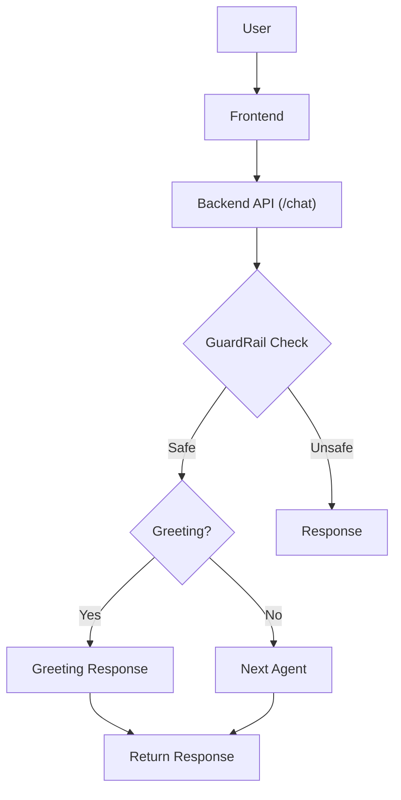

# System Architecture

```mermaid
flowchart TD
    A[User] --> B[Frontend]
    B --> C["Backend API (/chat)"]
    C --> D{GuardRail Check}

    D -->|Safe| E{Greeting?}
    D -->|Unsafe| Z[Response]

    E -->|Yes| G[Greeting Response]
    E -->|No| H[Next Agent]

    G --> R[Return Response]
    H --> R
```