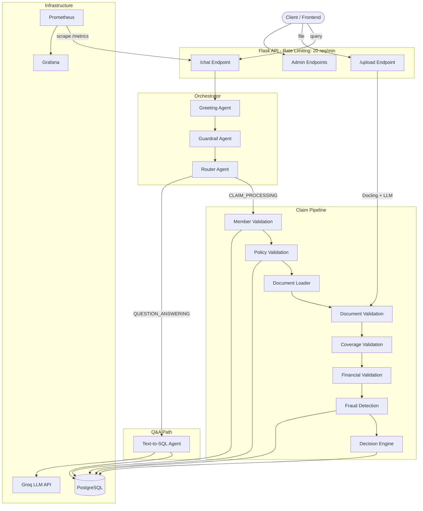

# Insurance Claims Processing Backend

An AI-powered backend for processing OPD (Out-Patient Department) health insurance claims. It ingests policy data, extracts structured information from uploaded medical documents (prescriptions, bills, lab reports), and runs each claim through a multi-step adjudication pipeline that validates member eligibility, policy coverage, financials, and fraud signals — ultimately producing an approve/reject/manual-review decision with a full audit trace.

## Architecture



The backend is a **Flask** application that exposes REST endpoints for document upload, chat-based claim processing, and admin operations. Every incoming chat query first passes through lightweight classifier agents (greeting, guardrail, router) before being dispatched to either the **claim pipeline** or the **text-to-SQL Q&A path**.

The claim pipeline is structured as a **sequential agent graph** — each node is an independent validation agent that receives the accumulated context from prior nodes and produces a typed result. This design was chosen over a monolithic function because each validation step (member, policy, documents, coverage, financials, fraud) has distinct failure modes, data requirements, and retry semantics. The graph structure makes it straightforward to add, reorder, or skip steps, and every node writes a trace record for auditability.

The Q&A path converts natural-language questions into SQL via a schema-aware LLM agent, executes the query, and returns structured results — useful for questions like "What are my recent claims?" without triggering the full claim pipeline.


## Folder Structure

```
backend/
├── main.py                  # Flask app, routes, startup
├── metrics.py               # Prometheus metric definitions
├── rate_limiter.py          # Custom Rate limiting decorator
├── db/
│   ├── schema.sql           # DDL for all tables and indexes
│   ├── metadata.json        # Column descriptions for Text-to-SQL agent
│   └── db.py                # Database connection and schema init
├── document_agent/
│   └── document_identifier.py  # Document parsing, classification, extraction, quality check
├── sub_agent/
│   ├── agent.py             # AgentOrchestrator — top-level routing graph
│   ├── greetingAgent.py     # Greeting classifier
│   ├── gaurdrailAgent.py    # Security guardrail
│   ├── routerAgent.py       # Intent router (claim vs. Q&A)
│   ├── policyAgent.py       # Claim pipeline (member, policy, document, coverage, financial, fraud, decision agents)
│   ├── decision_maker.py    # Standalone adjudication engine (v3.0)
│   ├── text_sqlAgent.py     # Natural-language to SQL agent
│   └── llm.py               # Groq/OpenAI LLM client wrapper
├── middleware/
│   └── auth.py              # Admin password auth decorator
├── services/
│   ├── data_ingestion.py    # Policy/member/hospital data loader
│   └── policy_claim.py      # (Legacy) claim helper
├── test/
│   └── test.py              # Automated claim test runner
├── Dockerfile               # Multi-layer cached build
├── prometheus.yml            # Scrape config
└── pyproject.toml            # Python 3.12, dependencies
```

## Request Lifecycle

1. **Chat request** arrives at `/chat` with a query, member ID, and claim category.
2. **Greeting Agent** checks if the message is a simple greeting — if so, replies immediately.
3. **Guardrail Agent** blocks off-topic or adversarial prompts.
4. **Router Agent** classifies the intent as `CLAIM_PROCESSING` or `QUESTION_ANSWERING`.
5. **Claim Processing** (if routed):
   - Validates the member exists and has an active policy.
   - Loads previously uploaded documents from disk.
   - Validates documents (type, quality, patient-name cross-check, required docs).
   - Creates a claim record in PostgreSQL.
   - Runs coverage checks (waiting periods, exclusions, pre-authorization).
   - Calculates financials (sub-limits, co-pay, network discounts, annual caps).
   - Evaluates fraud signals (claim frequency, same-day duplicates).
   - Decision engine aggregates all results → `APPROVED` / `PARTIALLY_APPROVED` / `REJECTED` / `MANUAL_REVIEW`.
   - Full trace is persisted; decision is saved.
6. **Q&A** (if routed): Text-to-SQL agent generates, validates, and executes a `SELECT` query.
7. **Response** is cleaned by `response_cleaner` into a consistent UI-friendly format.

## Tech Stack

| Category | Technology |
|---|---|
| **Framework** | Flask, Flask-CORS |
| **Language** | Python 3.12 |
| **LLM** | Groq API (Llama 3.3 70B) via OpenAI SDK |
| **Document Parsing** | Docling (langchain-docling) |
| **Image Quality** | OpenCV (blur, contrast, brightness, resolution scoring) |
| **Database** | PostgreSQL 17 |
| **DB Driver** | psycopg2 |
| **Validation** | Pydantic v2 |
| **Observability** | Prometheus + Grafana |
| **Containerization** | Docker, Docker Compose |
| **Package Manager** | uv |

## Key Features

- **Multi-agent claim pipeline** — seven sequential validation agents with early-exit on failure.
- **Document intelligence** — Docling-based parsing, LLM classification into 8 document types, structured field extraction, and image quality scoring.
- **Policy-driven rules** — coverage limits, waiting periods, exclusions, and required documents are read from the policy record, not hardcoded.
- **Fraud detection** — checks monthly claim frequency, same-day duplicates, and amount anomalies against configurable thresholds.
- **Text-to-SQL Q&A** — schema-aware natural-language queries with optional schema-linking step, SQL validation (SELECT-only), and structured result output.
- **Full audit trace** — every pipeline step is recorded in `claim_trace_steps` with inputs, outputs, and confidence scores.
- **Admin endpoints** — add policies, update claim decisions, reset database (protected by `X-Admin-Password` header).
- **Prometheus metrics** — HTTP latency, active requests, LLM call counts, per-agent duration, claim outcomes.


## Rate Limiting On Backend:

> **Rate Limiting:** Implemented using a Token Bucket algorithm to protect the API from request bursts. The bucket capacity is N requests per minute (configured via RATE_LIMIT_PER_MINUTE), and requests exceeding the available tokens receive an HTTP 429 (Too Many Requests) response until tokens are replenished.

```shell
PS C:\Users\Plum Assignment - 12-04-2026\test> k6 run test.js

         /\      Grafana   /‾‾/  
    /\  /  \     |\  __   /  /   
   /  \/    \    | |/ /  /   ‾‾\ 
  /          \   |   (  |  (‾)  |
 / __________ \  |_|\_\  \_____/ 


     execution: local
        script: test.js
        output: -

     scenarios: (100.00%) 1 scenario, 20 max VUs, 1m10s max duration (incl. graceful stop):
              * default: Up to 20 looping VUs for 40s over 3 stages (gracefulRampDown: 30s, gracefulStop: 30s)


  █ TOTAL RESULTS 

    CUSTOM
    rate_limited_requests..........: 10350  258.73735/s
    success_requests...............: 21     0.524974/s

    HTTP
    http_req_duration..............: avg=56.65ms min=560.2µs med=44.17ms max=179.47ms p(90)=128.65ms p(95)=141.23ms
      { expected_response:true }...: avg=26.52ms min=2.68ms  med=4.88ms  max=137.45ms p(90)=125.34ms p(95)=125.98ms
    http_req_failed................: 99.79% 10350 out of 10371
    http_reqs......................: 10371  259.262324/s

    EXECUTION
    iteration_duration.............: avg=58.36ms min=1.16ms  med=45.55ms max=182.49ms p(90)=131.84ms p(95)=144.33ms
    iterations.....................: 10371  259.262324/s
    vus............................: 1      min=1              max=20
    vus_max........................: 20     min=20             max=20

    NETWORK
    data_received..................: 2.6 MB 65 kB/s
    data_sent......................: 788 kB 20 kB/s


running (0m40.0s), 00/20 VUs, 10371 complete and 0 interrupted iterations
default ✓ [======================================] 00/20 VUs  40s 
```

## Agent / Graph Pipeline

The claim pipeline runs as a sequential graph where each node is a self-contained agent:

| Order | Agent | Purpose |
|---|---|---|
| 1 | **MemberValidationAgent** | Verifies member exists, has a policy, and has valid profile data |
| 2 | **PolicyAgent** | Checks policy exists, is active (not expired/terminated), and loads all policy rules |
| 3 | **DocumentValidationAgent** | Validates uploaded documents: type correctness, patient-name cross-match, required doc completeness |
| 4 | **CoverageAgent** | Checks waiting periods, exclusions, pre-authorization, submission windows, relationship eligibility |
| 5 | **FinancialAgent** | Calculates claimed vs. eligible vs. approved amounts; applies sub-limits, co-pay, network discounts, annual/family caps |
| 6 | **FraudAgent** | Scores fraud risk based on claim frequency, same-day claims, and policy-defined thresholds |
| 7 | **DecisionAgent** | Aggregates all results into a final decision with confidence score and explanation |

**Data flows forward**: each agent receives the member, policy, and document context accumulated by prior agents. If any agent fails with `fatal=True`, the pipeline exits early, generates a user-friendly error message via the LLM, and returns immediately. This avoids wasted compute and gives the user a clear reason for rejection.

**Why a graph instead of a linear pipeline?** A few reasons:
- **Independent failure handling** — a document validation failure is fundamentally different from a fraud flag; the graph lets each node define its own failure semantics.
- **Traceability** — each node writes a separate `claim_trace_steps` record, making audits trivial.
- **Extensibility** — adding a new check (e.g., a pre-authorization agent) means adding one node, not rewriting a monolithic function.

## Database Overview

PostgreSQL stores all operational data across 8 tables:

| Table | Purpose |
|---|---|
| `policies` | Policy configuration (coverage rules, limits, exclusions, fraud thresholds as JSONB) |
| `members` | Employee/dependent records linked to policies |
| `hospitals` | Hospital directory with network status |
| `network_hospitals` | Policy-specific network hospital mapping |
| `claims` | Claim records with status, amounts, confidence/fraud scores |
| `claim_documents` | Uploaded documents linked to claims (metadata + extracted data as JSONB) |
| `claim_decisions` | Final decisions with approved amounts, rejection reasons, explanations, and full trace |
| `claim_trace_steps` | Per-step audit trail (step name, status, confidence, input/output data) |
| `schema_metadata` | Column descriptions — consumed by the Text-to-SQL agent for schema awareness |

Policy rules (coverage, exclusions, waiting periods, fraud thresholds) are stored as JSONB columns. This keeps the schema stable while allowing per-policy rule variations without schema migrations.

## Environment Variables

| Variable | Description |
|---|---|
| `GROQ_API_KEY` | API key for Groq LLM |
| `GROQ_MODEL` | Model name (default: `llama-3.3-70b-versatile`) |
| `DB_HOST` | PostgreSQL host |
| `DB_PORT` | PostgreSQL port |
| `DB_NAME` | Database name |
| `DB_USER` | Database user |
| `DB_PASSWORD` | Database password |
| `ADMIN_PASSWORD` | Password for admin-protected endpoints |

## Local Development

```bash
# Prerequisites: Python 3.12, PostgreSQL, uv

# Install dependencies
uv sync --package backend

# Set up .env (copy backend/.env and update credentials)

# Start the server (auto-initializes schema)
cd backend
python main.py
```

The server starts on port `8000`. On startup it runs `schema.sql` to create tables and loads `metadata.json` into `schema_metadata`.

## Docker Deployment

```bash
# From the repo root
docker compose up --build
```

| Service | Port | Purpose |
|---|---|---|
| **frontend** (nginx) | `80` | Serves React app, proxies `/api/*` to backend |
| **backend** (Flask) | `8000` (internal) | API server |
| **postgres** | `8800 → 5432` | Database (exposed for local tooling) |
| **prometheus** | `9090` | Metrics collection |
| **grafana** | `3001` | Dashboards (admin/admin) |

The Dockerfile uses a layered caching strategy — dependency installation (`uv sync --frozen`) is cached separately from application code, so code-only changes rebuild in seconds.

## API Endpoints

| Method | Endpoint | Purpose |
|---|---|---|
| `GET` | `/chat` | Process a query (claim or Q&A) |
| `POST` | `/upload` | Upload and parse a medical document |
| `GET` | `/health` | Health check |
| `POST` | `/addPolicy` | Ingest a policy JSON (admin) |
| `GET` | `/claimPolicy` | Fetch claim-policy details for a member |
| `POST` | `/updateClaim` | Manually approve/reject a claim (admin) |
| `POST` | `/resetDB` | Drop and recreate all tables (admin) |
| `DELETE` | `/member/<id>/documents` | Delete all documents for a member |
| `POST` | `/test` | Run automated test cases |
| `GET` | `/test` | Fetch existing test results |
| `GET` | `/metrics` | Prometheus metrics endpoint |

Admin endpoints require the `X-Admin-Password` header.

## Observability

**Metrics** — The `/metrics` endpoint exposes Prometheus counters and histograms:
- `http_requests_total`, `http_request_duration_seconds` — per endpoint/method/status
- `claims_processed_total` — by decision outcome
- `claim_processing_seconds` — end-to-end pipeline latency
- `agent_duration_seconds` — per-agent timing (member, policy, coverage, etc.)
- `llm_calls_total`, `llm_duration_seconds` — LLM usage tracking
- `documents_processed_total`, `document_process_duration_seconds` — document pipeline

**Tracing** — Every claim pipeline step writes to `claim_trace_steps` with step name, status, confidence score, input/output data, and timestamp. The full trace is also stored as JSONB in `claim_decisions.trace`.

**Logging** — Standard `print` to stdout, captured by Docker and available via `docker compose logs`.

## Error Handling

- **Early exit** — The pipeline checks each agent's result immediately. If a step fails (`fatal=True`), remaining steps are skipped.
- **User-friendly messages** — On failure, the LLM generates a plain-language explanation from the step name and issue list, so the user sees "Your policy has expired" rather than a stack trace.
- **Graceful fallbacks** — The LLM client returns a fallback value (`{}` for JSON, `None` for text) on API errors. The guardrail agent defaults to blocking on failure (fail-closed).
- **Database resilience** — Connections use try/finally to ensure cleanup. Transactions are rolled back on error.
- **Document quality gate** — Images below the quality threshold are rejected before any LLM processing, saving API calls.
- **SQL safety** — The Text-to-SQL agent validates that generated queries are `SELECT`-only and strips markdown artifacts.
- **Manual review** — Claims flagged by fraud detection are routed to `MANUAL_REVIEW` rather than auto-rejected, allowing human override via `/updateClaim`.

## Design Decisions & Trade-offs

**Groq + Llama 3.3 70B** — Chosen for fast inference and generous free-tier limits. The OpenAI-compatible SDK makes it easy to swap providers. Trade-off: Llama's structured output is less reliable than GPT-4, so we use Pydantic validation as a safety net.

**Sequential pipeline over parallel** — Agents run sequentially because each depends on prior results (you can't check coverage without a validated policy). This adds latency but keeps the logic simple and debuggable. A production system could parallelize independent steps (e.g., fraud + financial checks).

**JSONB for policy rules** — Storing coverage, exclusions, and thresholds as JSONB avoids a normalized multi-table schema for rules that vary wildly between policies. Trade-off: no DB-level validation of rule structure.

**File-based document storage** — Uploaded documents are stored on the filesystem (`documents/<member_id>/`) rather than S3/GCS. Acceptable for an assignment; production would use object storage with signed URLs.

**Flask dev server** — The app runs with `debug=True`. Production would use Gunicorn behind nginx (the Docker setup already proxies through nginx).

**Single LLM client** — All agents share the same Groq model. In production, you'd use different models for different tasks (a small model for routing, a large one for extraction).

**What I'd improve: **
- Add Gunicorn + worker processes for concurrent request handling.
- Implement structured logging (JSON) with correlation IDs.
- Move document storage to S3 with pre-signed URLs.
- Implement async processing for claim pipelines with webhook callbacks.
- Add unit tests for individual agents (currently only integration tests exist).

## Scalability

The architecture supports horizontal scaling with a few changes:

- **Stateless backend** — No in-memory session state. Deploy multiple Flask instances behind a load balancer.
- **Shared PostgreSQL** — All state lives in the database. Connection pooling (PgBouncer) would be needed at scale.
- **Document storage** — Move from local filesystem to S3 to decouple storage from compute.
- **Async processing** — Long-running claim pipelines could be pushed to a task queue (Celery/Redis) with status polling.
- **LLM scaling** — The `LLMClient` wrapper makes it easy to add retry logic, model routing, or multiple API key rotation.
- **Prometheus + Grafana** — Already in place for monitoring. Add alerting rules for latency spikes, error rates, and LLM failures.