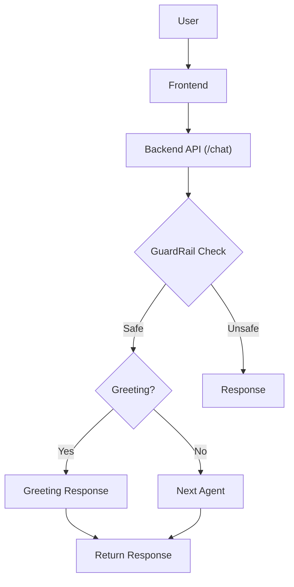

# System Architecture

Claim Submission
        
        
1. Member Validation     
        
2. Policy Validation
        
3. Document Verification
        
4. Document Quality Check
        
5. OCR + Extraction
        
6. Consistency Validation
        
7. Coverage Validation
        
8. Waiting Period Check
        
9. Exclusion Check
        
10. Pre-Auth Check
        
11. Fraud Check
        
12. Financial Calculation
        
13. Decision Generation
        
14. Explanation Generation