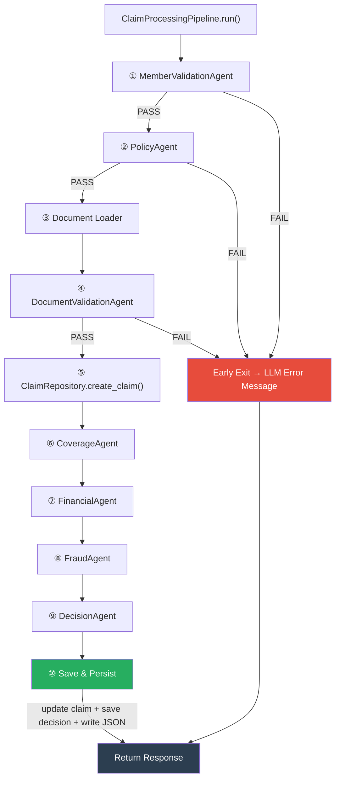

# Claim Processing Pipeline — `policyAgent.py`

This file contains the entire **claim adjudication pipeline** — seven sequential validation agents, two database repositories, and the orchestrating `ClaimProcessingPipeline` class. It is the core of the backend: every claim submitted through `/chat` is processed here.

---

## Architecture Overview



The pipeline executes **top-to-bottom**. Each agent receives the accumulated state from previous agents and produces a `StepResult` (pass/fail with confidence) plus a typed output model. If any agent fails with `fatal=True`, the pipeline **exits immediately** — remaining agents are skipped, and an LLM-generated user-friendly error message is returned.

Every agent's execution time is tracked via `AGENT_DURATION` Prometheus histograms. Every step trace is persisted to `claim_trace_steps` in PostgreSQL.

---

## Class Hierarchy

```
BaseAgent                         ← shared DB access, LLM client, ok/fail/check helpers
├── MemberValidationAgent         ← Step 1
├── PolicyAgent                   ← Step 2
├── DocumentValidationAgent       ← Step 3
├── CoverageAgent                 ← Step 4
├── FinancialAgent                ← Step 5
├── FraudAgent                    ← Step 6
├── DecisionAgent                 ← Step 7
└── ClaimRepository               ← DB persistence (claims, documents)

TraceRepository                   ← writes claim_trace_steps
DecisionRepository                ← writes claim_decisions

ClaimProcessingPipeline           ← orchestrator that runs all agents in sequence
```

### BaseAgent

All agents inherit from `BaseAgent`, which provides:

| Method | Purpose |
|---|---|
| `_db_connect()` | Creates a psycopg2 connection from env vars |
| `fetch_one(query, values)` | Executes a query, returns a single dict row |
| `ok(step, reason, ...)` | Creates a `StepResult` with `PASSED` status |
| `fail(step, reason, ...)` | Creates a `StepResult` with `FAILED` + `fatal=True` |
| `check_pass/fail/warn(name)` | Creates sub-check `CheckResult` entries for granular tracing |

---

## Pydantic Data Models

| Model | Purpose |
|---|---|
| `ClaimInput` | Input: member_id, documents, claim_category |
| `MemberData` | Member profile from DB (name, policy_id, relationship, join_date) |
| `PolicyData` | Full policy config (coverage, exclusions, waiting_periods, fraud_thresholds, etc.) |
| `DocumentValidationOutput` | Uploaded doc types, patient/hospital names, missing docs, issues/warnings |
| `CoverageValidationOutput` | Booleans for each coverage check + rejection reasons |
| `FinancialValidationOutput` | Claimed/eligible/approved amounts, all limit breakdowns, rejected line items |
| `FraudValidationOutput` | Fraud score, monthly/same-day claim counts, manual review flag |
| `DecisionOutput` | Final decision, amounts, explanation, financial breakdown |
| `StepResult` | Per-step result with status, confidence, reason, details, sub-checks |
| `CheckResult` | Granular sub-check within a step (e.g., "Policy DB Check", "Copay Check") |

---

## Agent-by-Agent Breakdown

### ① MemberValidationAgent

**Purpose:** Verify the member exists, has a valid profile, and is linked to a policy.

**Checks performed:**

| Check | Fails If |
|---|---|
| Member Input Check | `member_id` is empty or `None` |
| Member DB Check | No row found in `members` table for the given ID |
| Member Policy Check | Member exists but has no `policy_id` assigned |
| Member Name Check | Member exists but `name` is null/empty (invalid profile) |

**Failure behavior:** Returns `FAILED` + `fatal=True`. Pipeline exits immediately. No claim record is created.

**Output on success:** `MemberData` with member_id, name, policy_id, relationship, join_date, primary_member_id.

---

### ② PolicyAgent

**Purpose:** Validate the member's policy exists and is currently active.

**Checks performed:**

| Check | Fails If |
|---|---|
| Policy DB Check | No row found in `policies` for the member's `policy_id` |
| Policy Start Date Check | `policy_start_date` is in the future (policy not yet active) |
| Policy End Date Check | `policy_end_date` is in the past (policy expired) |
| Policy Renewal Status Check | `renewal_status` is `EXPIRED` or `TERMINATED` |
| Policy Data Check | Validates policy data was correctly loaded into `PolicyData` model |

**Failure behavior:** Returns `FAILED` + `fatal=True`. Pipeline exits. The member is valid but cannot file claims under this policy.

**Output on success:** `PolicyData` containing all policy rules as structured fields (coverage, exclusions, waiting_periods, submission_rules, document_requirements, fraud_thresholds).

---

### ③ Document Loader (`_load_documents`)

**Purpose:** Load previously uploaded and extracted documents from the filesystem.

**How it works:**
1. Looks for `./documents/<member_id>/` (or `./documents/<testing_id>/` in test mode).
2. Reads all `*.json` files — these are the structured outputs from the `DocumentAgent` upload pipeline.
3. Extracts the `data` key from each payload.

**Fails if:**
- The documents directory does not exist.
- The claim category is not configured in the policy's `document_requirements`.
- No required documents are specified but the folder is missing.

**Note:** This is not a standalone agent — it runs as a method within `ClaimProcessingPipeline` before `DocumentValidationAgent`.

---

### ④ DocumentValidationAgent

**Purpose:** Validate that uploaded documents are complete, correct, and consistent.

**Checks performed:**

| Check | Fails If | Severity |
|---|---|---|
| Document Uploads Check | No documents were loaded at all | **FATAL** |
| Claim Category Check | The claim category has no `document_requirements` in the policy | **FATAL** |
| Document Confidence Check | Per-document extraction confidence < 0.40 → "unreadable" | Issue |
| Low Confidence Warning | Per-document extraction confidence 0.40–0.70 | Warning |
| Patient Name Cross-Match (inter-document) | Patient names across documents differ by > 20% (SequenceMatcher) | Issue |
| Patient Name vs Member Match | Document patient name differs from member name by > 20% | Issue |
| Hospital Name Cross-Match | Hospital names across documents differ by > 25% | Warning |
| Missing Hospital Name | No hospital found and category ≠ PRESCRIPTION | Warning |
| Missing Required Documents | Required doc types per policy not present in uploads | Issue |
| Duplicate Document Check | Same document type uploaded more than once | Warning |

**Failure logic:** The agent collects all issues into `output.issues`. If any issues exist → `validation_passed = False` → returns `FAILED`. Warnings do not cause failure.

**Key design:** Missing documents are checked against the **policy's `document_requirements`** for the specific claim category, not hardcoded lists. This means different policies can require different documents.

---

### ⑤ ClaimRepository (Claim Creation)

After document validation passes, the pipeline:

1. **Creates a claim record** in the `claims` table with status `PROCESSING`.
2. **Submits document metadata** to `claim_documents` — linking each uploaded document (type, quality score, extracted data) to the claim.
3. **Writes the first trace step** to `claim_trace_steps`.

This happens before coverage/financial/fraud checks so the claim has a DB record even if later steps fail.

---

### ⑥ CoverageAgent

**Purpose:** Verify the claim is eligible under the member's policy terms.

**Checks performed:**

| Check | Fails If | Details |
|---|---|---|
| Claimed Amount Extraction | — | Extracts the claimed amount from document `total_amount` or by summing `line_items`. Takes the max across all documents. |
| Relationship Check | Member's `relationship` is not in the policy's `covered_relationships` list | e.g., "parent-in-law" not covered |
| Initial Waiting Period | `days_since_join < initial_waiting_period_days` | e.g., member joined 10 days ago, policy requires 30 |
| Treatment Date Before Enrollment | `treatment_date < member.join_date` | Immediate fatal exit |
| Pre-Authorization (DIAGNOSTIC) | High-value test exceeds `pre_auth_threshold` AND no `PRE_AUTH` document uploaded | Checks `high_value_tests_requiring_pre_auth` from OPD category rules |
| Specific Condition Waiting Period | Diagnosis matches a condition in `specific_conditions` and insufficient days since join | e.g., "dental" requires 365 days |
| Exclusion Check | Diagnosis/tests/line-items contain keywords matching `policy.exclusions.conditions` | Keyword-based matching on words > 4 characters |
| Minimum Claim Amount | `claimed_amount < minimum_claim_amount` from submission rules | e.g., claims below ₹100 not accepted |
| Submission Window | `days_since_treatment > deadline_days_from_treatment` | e.g., must submit within 30 days of treatment |

**Failure logic:** All rejection reasons are collected. If any exist → `FAILED`. Multiple reasons can be reported simultaneously.

**Pre-authorization flow (DIAGNOSTIC claims):**
1. Loads `opd_categories.diagnostic` from the policy.
2. Checks if any test in the documents matches `high_value_tests_requiring_pre_auth`.
3. If matched AND `claimed_amount > pre_auth_threshold` AND no `PRE_AUTH` document type was uploaded → rejection.

---

### ⑦ FinancialAgent

**Purpose:** Calculate the approved amount by applying all financial limits, deductions, and caps.

**Calculation waterfall (in order):**

```
Claimed Amount
  └─ Network Hospital Discount (if hospital is in network)
       └─ Co-pay Deduction (percentage from OPD category rules)
            └─ Excluded Line Items (items matching excluded_procedures are subtracted)
                 └─ Per-Claim Limit (capped at policy.coverage.per_claim_limit)
                      └─ Sub-Limit (capped at category-specific sub_limit)
                           └─ Annual OPD Limit (capped at remaining annual allowance)
                                └─ Family Floater Limit (capped at remaining family pool)
                                     └─ Approved Amount
```

**Checks performed:**

| Check | Fails If |
|---|---|
| Claimed Amount Check | No amount could be determined from documents (≤ 0) → **FATAL** |
| Network Discount | Hospital name matches a network hospital → discount applied |
| Co-pay Deduction | Category has `copay_percent` > 0 → deducted |
| Excluded Line Items | Line items matching `excluded_procedures` → subtracted, tracked in `reduct_items` |
| Per-Claim Limit Check | Amount exceeds `per_claim_limit` → capped |
| Sub-Limit | Category has a `sub_limit` → capped |
| Annual Limit Check | Queries `claim_decisions` for year-to-date usage → caps remaining |
| Family Floater Limit Check | Queries all family members' usage → caps remaining family pool |
| Final Amount Check | If `approved_amount ≤ 0` after all deductions → **FATAL** ("No remaining coverage") |

**Key queries:**
- `_get_annual_usage(member_id)` → SUM of approved amounts for the current year.
- `_get_family_floater_usage(member)` → SUM of approved amounts across all family members (primary + dependents).

---

### ⑧ FraudAgent

**Purpose:** Score fraud risk and flag claims for manual review.

**Fraud signals:**

| Signal | Score Added | Threshold Source | Triggers Manual Review |
|---|---|---|---|
| Monthly claims count | +0.30 | `fraud_thresholds.monthly_claims_limit` | No |
| Same-day claims | +0.25 | `fraud_thresholds.same_day_claims_limit` | **Yes** |
| High-value claim | +0.20 | `fraud_thresholds.high_value_claim_threshold` | No |
| Amount exceeds manual review threshold | — | `fraud_thresholds.auto_manual_review_above` | **Yes** |
| Aggregate fraud score ≥ threshold | — | `fraud_thresholds.fraud_score_manual_review_threshold` (default 0.8) | **Yes** |

**Key behavior:**
- The fraud score is **additive** — multiple signals stack (capped at 1.0).
- The FraudAgent **never fails fatally**. It always returns `PASSED`. However, it sets `manual_review_required = True` which the DecisionAgent uses to route to `MANUAL_REVIEW`.
- Same-day claims are checked by `treatment_date` if available, otherwise by `submission_date`.

---

### ⑨ DecisionAgent

**Purpose:** Aggregate all validation results into a final decision.

**Decision logic (priority order):**

```python
if coverage FAILED       → REJECTED
elif financial FAILED    → REJECTED
elif fraud.manual_review → MANUAL_REVIEW
elif approved < claimed  → PARTIALLY_APPROVED
else                     → APPROVED
```

**Post-decision:**
1. Calls the LLM to generate a customer-friendly **explanation** (< 80 words).
2. Builds a **financial breakdown** table showing each deduction step (network discount, co-pay, sub-limit, per-claim limit, annual limit, family limit, excluded items).
3. Returns `DecisionOutput` with the final decision, amounts, fraud score, explanation, and breakdown.

---

## Early Exit & Error Handling

The `_fail_early()` method is called after each agent. When a step fails:

1. Collects all issues from the `StepResult.reason`, output model's `issues`, `missing_document_types`, and `rejection_reasons`.
2. Stores them in `response["error_issues"]`.
3. Calls `_generate_message()` → sends the step name + issues to the LLM with a system prompt that produces a customer-friendly explanation (< 80 words, no technical jargon).
4. Returns the partial response immediately.

**Exception handling:**
- The entire `run()` method is wrapped in try/except.
- Unexpected errors increment `CLAIM_PIPELINE_ERROR` and also generate an LLM error message.
- `CLAIM_PROCESSING_TIME` is recorded in the `finally` block regardless of success/failure.

---

## Scenarios Covered

### Membership & Policy Scenarios

| Scenario | Agent | Outcome |
|---|---|---|
| Member ID not provided | MemberValidation | FAILED — "Member ID is required" |
| Member not found in DB | MemberValidation | FAILED — "Member not found" |
| Member has no policy assigned | MemberValidation | FAILED — "No assigned policy" |
| Member has empty name | MemberValidation | FAILED — "Invalid profile data" |
| Policy not found in DB | PolicyAgent | FAILED — "Policy not found" |
| Policy start date in future | PolicyAgent | FAILED — "Policy not yet active" |
| Policy end date in past | PolicyAgent | FAILED — "Policy expired" |
| Policy renewal status EXPIRED/TERMINATED | PolicyAgent | FAILED — "Policy status is EXPIRED" |

### Document Scenarios

| Scenario | Agent | Outcome |
|---|---|---|
| No documents uploaded at all | DocumentValidation | FAILED — "No documents uploaded" |
| Unsupported claim category | DocumentValidation | FAILED — "Unsupported claim category" |
| Required documents missing | DocumentValidation | FAILED — lists missing doc types |
| Document extraction confidence < 0.40 | DocumentValidation | Issue — "unreadable" |
| Document extraction confidence 0.40–0.70 | DocumentValidation | Warning — "low extraction confidence" |
| Patient name mismatch across documents | DocumentValidation | Issue — names differ > 20% |
| Patient name doesn't match member name | DocumentValidation | Issue — document patient ≠ member |
| Hospital name mismatch across documents | DocumentValidation | Warning — names differ > 25% |
| Duplicate document types uploaded | DocumentValidation | Warning — "Duplicate document" |
| Documents directory not found | Document Loader | Exception — lists required documents |

### Coverage Scenarios

| Scenario | Agent | Outcome |
|---|---|---|
| Relationship not in covered list | CoverageAgent | Rejection reason added |
| Initial waiting period not met | CoverageAgent | Rejection — "X days not completed" |
| Treatment before enrollment date | CoverageAgent | Immediate FAILED |
| Pre-auth required but not provided (DIAGNOSTIC) | CoverageAgent | Rejection — "Pre-authorization required" |
| Specific condition waiting period not met | CoverageAgent | Rejection — "Condition requires X days" |
| Diagnosis matches exclusion keywords | CoverageAgent | Rejection — "EXCLUDED_CONDITION" |
| Claim below minimum amount | CoverageAgent | Rejection — "Below minimum" |
| Submission past deadline | CoverageAgent | Rejection — "After allowed X day limit" |

### Financial Scenarios

| Scenario | Agent | Outcome |
|---|---|---|
| Cannot determine claim amount | FinancialAgent | FAILED — "Unable to determine claim amount" |
| Network hospital → discount applied | FinancialAgent | Amount reduced by `network_discount_percent` |
| Co-pay configured → deduction applied | FinancialAgent | Amount reduced by `copay_percent` |
| Line items match excluded procedures | FinancialAgent | Items subtracted, tracked in `reduct_items` |
| Amount exceeds per-claim limit | FinancialAgent | Capped at `per_claim_limit` |
| Amount exceeds category sub-limit | FinancialAgent | Capped at `sub_limit` |
| Annual OPD limit exhausted | FinancialAgent | Capped at remaining annual balance |
| Family floater limit exhausted | FinancialAgent | Capped at remaining family balance |
| Approved amount ≤ 0 after all deductions | FinancialAgent | FAILED — "No remaining coverage" |

### Fraud Scenarios

| Scenario | Agent | Outcome |
|---|---|---|
| Monthly claims exceed limit | FraudAgent | Fraud score +0.30 |
| Same-day claims exceed limit | FraudAgent | Fraud score +0.25, manual review flagged |
| High-value claim above threshold | FraudAgent | Fraud score +0.20 |
| Amount exceeds manual review threshold | FraudAgent | Manual review flagged |
| Aggregate fraud score ≥ threshold | FraudAgent | Manual review flagged |

### Decision Scenarios

| Scenario | Agent | Outcome |
|---|---|---|
| Coverage validation failed | DecisionAgent | `REJECTED` |
| Financial validation failed | DecisionAgent | `REJECTED` |
| Fraud flags manual review | DecisionAgent | `MANUAL_REVIEW` |
| Approved amount < claimed amount | DecisionAgent | `PARTIALLY_APPROVED` |
| All checks pass, full amount approved | DecisionAgent | `APPROVED` |

---

## Database Persistence

The pipeline writes to four tables:

| Table | When | What |
|---|---|---|
| `claims` | After document validation passes | Claim record (status = `PROCESSING`) |
| `claim_documents` | After document validation passes | Each document's type, quality score, extracted data |
| `claim_trace_steps` | After each agent completes | Step name, status, confidence, input/output data |
| `claim_decisions` | After final decision | Decision, approved amount, explanation, full trace as JSONB |

The claim record is **updated** after the decision with the final status, confidence score, and fraud score.

---

## Prometheus Metrics

| Metric | Type | Labels |
|---|---|---|
| `agent_duration_seconds` | Histogram | `agent` (member_validation, policy_validation, coverage_validation, financial_validation, fraud_validation, decision_engine, etc.) |
| `claim_processing_seconds` | Histogram | — (end-to-end) |
| `claims_processed_total` | Counter | `decision` (APPROVED, REJECTED, etc.) |
| `claim_pipeline_error_total` | Counter | — (unexpected exceptions) |

---

## Financial Calculation Example

```
Claimed Amount:                     ₹5,000
├─ Network Discount (10%):          - ₹500   → ₹4,500
├─ Co-pay (20%):                    - ₹900   → ₹3,600
├─ Excluded Line Items:             - ₹200   → ₹3,400
├─ Per-Claim Limit (₹5,000):         no cap  → ₹3,400
├─ Sub-Limit (₹4,000):               no cap  → ₹3,400
├─ Annual Limit (₹10,000 remaining): no cap  → ₹3,400
└─ Family Floater (₹15,000 remaining): no cap → ₹3,400

Approved Amount: ₹3,400
Decision: PARTIALLY_APPROVED (₹3,400 < ₹5,000)
```

---

## Design Decisions

**Why sequential, not parallel?** Each agent depends on prior outputs. You can't check coverage without a validated policy. You can't calculate financials without knowing the claim category from documents. Sequential also makes debugging straightforward — the trace shows exactly where a claim failed and why.

**Why does FraudAgent never fail fatally?** Fraud signals are probabilistic. A high fraud score doesn't mean the claim is invalid — it means a human should review it. Auto-rejecting on fraud signals would create false negatives and frustrate legitimate claimants.

**Why are policy rules in JSONB, not hardcoded?** Different employers buy different policies. Hardcoded rules would require code changes for each policy. JSONB lets us store coverage limits, exclusion lists, waiting periods, and fraud thresholds per-policy, loaded at runtime.

**Why fuzzy patient name matching (SequenceMatcher)?** OCR output is imperfect. "JOHN SMITH" might be extracted as "JOHN SMTH" or "JOHN  SMITH". The 80% similarity threshold catches genuine mismatches while tolerating minor OCR errors.
